```mermaid
gantt
    dateFormat  DD-MMM
    title       Project schedule
    excludes    weekends
    todayMarker stroke-width:20px,stroke:#BADA55,opacity:0.23
    axisFormat  %H%p-%a-%d-%B

    section Project Start
    0.1 Setup first meetings(s)                        :active, 03/06/2021, 6h
    0.2 Define and collect briefing document               :active, 8h
    0.3 Define and send project questionnaire              :active, 8h
    0.4 Research client’s company                          :active, 4h
    0.5 Research client’s industry                         :active, 4h
    0.6 Estimate  development effort                       :done, 1h
    0.7 Estimate   design work                             :done, 1h
    0.9 Estimate for photography / video production        :done, 1h
    0.10 Estimate  Hosting / Domain                        :done, 1h
    0.11 Prepare and send Proposal                        :active, 2h
    0.12 Approval  meeting                                :active, 1h
    0.13  Project Acceptance timeline with milestones        :active, 4h
    0.14  client signoff Meeting                           :active, 4h
    section Design
    16 Create a sitemap :active, 8h
    17 Research and buy template :active, 8h
    18 Create a wireframe of custom designs :active, 8h
    19. Allocate time and effort for a designer :active, 8h
    20. Allocate time and effort for content creation/copy :active, 8h
    21. Research, buy and tweak stock images or find free images you can use :active, 8h
    22. Allocate time and effort for photography (based on estimates sent to the client) :active, 8h
    23. Allocate time and effort for video productions (based on estimates sent to the client) :active, 8h
    24. Define privacy policy and other legal text required for the website :active, 8h
    25. Send design(s) to the client for approval and wait for approval :active, 8h
    26. Get designers to perform any required design changes :active, 8h
    27. Send designs to web developers including template, together with designs, for the start of research and development :active, 1d
    28. Send specifications and updates to the client and wait for sign off :active, 8h
    section Development
    29. Send finalized designs to developers :active, 8h
    30. Allocate development checklists to the various developers :active, 8h
    31. Agree with all developers client on a date for Alpha :active, 8h
    32. Reach out to content creators and ensure they are on target :active, 8h
    33. Ensure you’ve bought hosting or created a hosting space for your website :done, 3h
    34. Create a new database(s) :done, 3h
    35. Upload the website source files :done, 3h
    36. Install/configure the CMS :done, 3h
    37. export/import the database staging/production server :done, 3h
    38. Change the nameservers :done, 3h
    39. Create the website site map :done, 3h
    40. Collect all content :done, 23h
    41. Quality assure each piece of content :done, 8h
    42. Populate the website content :done, 3h
    43. Define a Contact Us page :done, 3h
    44. Populate links/iconography with links to relevant social media details :done, 3h
    45. Create a link to your website in the footer :crit, 10h
    46. Send current iteration to client and request feedback :done, 3h
    47. Fix and change any requests by the client :done, 3h
    48. Send updates to client and wait for client sign-off :done, 3h


    section Deployment


    section Content

```

## Stage 0 – Project Start – Preparation

Is web design only about design? Not really! Although most of us love the creative part of designing and developing a website, there are quite a few things we need to do before we actually get to that. Before we get down to the nitty-gritty – we’ll need to lay the groundwork and set a few rules.

* [ ] 1. Setup first meetings(s) with client

* [ ] 2. Define and collect briefing document from the client

* [ ] 3. Define and send a project questionnaire to the client and wait for the client’s response. Iterate on doubts you have until everybody is in agreement. Finalize project questionnaire from client

* [ ] 4. Research client’s company to understand their brand, the way they communicate, their demographics, target audience

* [ ] 5. Research client’s industry to find ways of communicating specifically to the industry, strengths and weaknesses, trends and other industry specifics

* [ ] 6. Get quotation(s) for development effort for the project

* [ ] 7. Get quotations(s) for design or estimate design work with your own designers

* [ ] 8. Get quotation(s) for copy/content or estimate work with your copywriters

* [ ] 9. Get quotation(s) for photography / video production or estimate effort involved

* [ ] 10. Get quotation(s) for Hosting / Domain, particularly if specialized hosting is involved such as VPS hosting, cloud hosting, or special hosting or environment requirements

* [ ] 11. Prepare and send a great web design proposal to the client – use the web design quotation tool to send an itemized quotation

* [ ] 12. Get approval from the client of proposal and features to be implemented

* [ ] 13. Create the Project Acceptance Form, and propose a timeline with milestones

14. Send Project Acceptance Form, with timelines to the client and wait for client signoff

## Stage 1 – Project Kick off

15. Kick-off email to developers, designers, and other stakeholders

6. Create a sitemap of the website with proposed sections, pages

17. Research and buy template used as a basis for the design

18. Create a wireframe of specific pages which require custom designs

19. Allocate time and effort for a designer to create the wireframes based on the estimates sent to the client and brief designers on wireframe designs.

20. Allocate time and effort for content creation/copy

21. Research, buy and tweak stock images or find free images you can use

22. Allocate time and effort for photography (based on estimates sent to the client)

23. Allocate time and effort for video productions (based on estimates sent to the client)

24. Define privacy policy and other legal text required for the website

25. Send design(s) to the client for approval and wait for approval

26. Get designers to perform any required design changes

27. Send designs to web developers including template, together with designs, for the start of research and development

28. Send specifications and updates to the client and wait for sign off

Once the designs have been completed and you’ve set the stage for what you want the final result to be like, it’s time to start developing. Besides the developers per se, you’ve also got to set the environment, ensure the domain is in place and set up correctly, create databases and ensure the production environments are ready.

## Stage 2 – Development

29. Send finalized designs to developers

30. Allocate development checklists to the various developers

31. Agree with all developers + client on a date for Alpha

32. Reach out to content creators and ensure they are on target

### Stage 2.1 – Set up Hosting Account

33. Ensure you’ve bought hosting or created a hosting space for your website

34. Create a new database(s), and database users as necessary if you are using a CMS, or a website which requires a database

35. Upload the website source files

36. Install/configure the CMS to use the database you have created

37. If your website has been created already and you need to migrate it, export the database from the testing/staging server and import it to the production server

38. Change the nameservers of the domain you will be using to the nameservers of the hosting server you will be using
Stage 2.2 – Set Up Website Content

39. Create the website site map and structure you had defined with the client via your favourite CMS or the framework/technology you have chosen to develop your website

40. Collect all content from the various content creators you have outsourced

41. Quality assure each piece of content you have outsourced or bought – and ask for changes where necessary

42. Populate the website content with the various content items you have agreed with the client

43. Define a Contact Us page with correct client details and a map

44. Populate links/iconography with links to relevant social media details

45. Create a link to your website in the footer (if agreed with the client to do this)

46. Send current iteration to client and request feedback

47. Fix and change any requests by the client

48. Send updates to client and wait for client sign-off

There is nothing more important than ensuring the developed product is fit for purpose through several types of quality assurance. After all, this is what will keep your clients coming back for more. An eye for detail here will ensure you will keep getting recommendations and repeat business. Most of all, the things which might not be immediately apparent, but make a significant difference, need to be given due importance.

## Stage 3 – Quality Assurance
### Stage 3.1 – Code Quality

49. Validate HTML using W3C HTML Validator, or your preferred Browser extension such as Validity Chrome Extension, or Html Validator plugin for FireFox

50. Validate CSS using this CSS Validator, Validity for Chrome, or Html Validator

51. Lint your CSS to make it better

52. Use JSLint and JSHint to make your JavaScript better

53. Check whether your website is internationalization ready here

54. Ask for changes from developers based on the results of the above tests

### Stage 3.2 – Page Content

55. Make sure web copywriting has been proofread and ran through a spelling and grammar checker to check for correctness. Use online tools such as Reverso, or Spellcheckplus.com

56. Check that generic content, such as lorem ipsum, has been properly removed and replaced.

57. See that all images are in the correct places, smushed, formatted, width and height specified and working on all devices.

58. Confirm that videos and audio files are in the correct places, formatted and working on all devices.

59. Test all linked content, such as case studies, ebooks, and whitepapers, and verify that they are correctly linked.

60. Test to see that all internal links across web pages are working properly

61. Ensure that Contact Us and other forms are submitting data properly. If the form is sent to an email address ensure that email is received on a mailbox that is monitored, or ensure that content is correctly stored in your database.

62. Verify the Thank-you message or page displayed after the form is submitted

63. Check that Auto-responders are working properly and text in emails has been proofed

64. External links across web pages are working properly, and open in a new tab (Fix any broken links using this tool)

65. Ensure that Social media share icons are working properly – that there is a good image for sharing and that the description for sharing is appropriate.

66. Correct your metadata as necessary to ensure social media sharing is working ok.

67. Use the Facebook linter to ensure your Facebook sharing will work well

68. Implement Twitter Cards and confirm it works well on the Preview tool

69. Ensure that the company logo is linked to the homepage.

70. Check that load time for site pages is optimized (confirm with multiple sources) such as GTMetrix and Pingdom tools. If not – do the following steps to make your WordPress website load faster

71. Try a non-existing address on your page to check the 404 pages and 404 redirect pages are in place

72. Integrations with third-party tools, such as your CRM, e-commerce software, and/or marketing platform should be tested to ensure they are running smoothly

73. Choose www vs no-www and make sure that ONLY one of them is working to ensure you don’t get penalized for duplicate content. After choosing one, make sure one redirects to the other.

74. Check on multiple browsers using browsershots or browserling

### Stage 3.4 – Responsive and Mobile Friendly

75. Make sure you are using the viewport meta tag: `<meta name=”viewport” content=”initial-scale=1″>`

76. Check that Google sees your page as Mobile-Friendly. You should have fixed most of the Google Mobile Insights problems here

77. Use correct input types for email, phone and URL input form fields to ensure these are rendered correctly on mobile phones

78. Check how the site looks on emulators such as ipads, screenfly, mobilephonesimulator.

79. Test the site using real devices you have accessible to you or use opendevicelab.com

80. Send the finished site to your client and get feedback

81. Fix and change any requests by the client

82. Send updates to client and wait for client sign-off

Once you’re happy with the site you have developed you can start thinking about the Launch process and of course how to get the maximum value out of the launched site. There are many tools out there to help you reap maximum benefit for yourself and for your clients.

## Stage 4 – Launch

### Stage 4.1 – Analytics

83. Register and verify the site with Google WebMasters aka Google Search Console

84. Create a new property and implement Google Analytics code.

85. Make sure you link Google WebMasters and Google Analytics to be able to get better insights from within Google Analytics

86. Exclude relevant IP addresses (such as office IP) from analytics tracking to ensure your own company’s and the client’s company do not inflate their website hits

87. Set up any funnels, goals, or tracking events which have been properly created in your analytics software

88. Implement visitor tracking software such as HotJar, CrazyEgg, or Optimizely

89. Implement any site uptime monitor such as Pingdom

90. Implement a website backup service as necessary and make sure site is fully secure, so that it is well protected from hackers and you are not a victim of WordPress site hacking.

91. Sign-off the deliverables and invoice your client 🙂

### Stage 4.2 – Search Engine Optimization

92. Check that all pages have unique page titles (with a recommended length of fewer than 70 characters, including any keywords).

93. Check that all pages have unique meta descriptions (with a recommended length of fewer than 156 characters, including keywords) – the meta description should be human-friendly – not optimized for search engines. Think about it this way: “If you wanted to use 156 characters to describe exactly what that article contains, what would you say?”

94. Verify that pages have your chosen keywords included without any keyword stuffing (do not over-emphasize particular keywords)

95. See that all pages have metadata which is properly in place (with correct spelling and grammar) for any content which you want to be shared via Social

96. Ensure that relevant Alt tags have been added to every image.

97. Make sure that a dynamic XML sitemap (which gets updated with every post you make) has been created and verify that the XML sitemap has been submitted to search engines via Google WebMasters.

98. Ensure that Google is able to read it correctly.

99. Submit to Bing and possibly Yandex WebMasters too.

100. See that all page URLs consistently reflect site information architecture.

101. If you have had another older website, make sure you have 301 redirects in place for all old URLs (redirecting old pages to new ones).

102. Where necessary ensure that rel=”nofollow” tags are in place on applicable links and pages.

103. Use schema creator to insert Microdata into your pages (or tag your content in google WebMasters Data Highlighter)

104. Check the semantics of your site using this

### Stage 4.3 – Speed and Performance

* [ ] 105. Try to get a PageSpeed score of 90+ – this PageSpeed Insights guide from Kinsta will surely help.

* [ ] 106. Minify your javascript

* [ ] 107. Minify your CSS

* [ ] 108. Add Expires Header – Leverage browser caching to ensure that files which don’t change often are fetched from the browser cache rather than downloaded again

* [ ] 109. Ensure a Yslow score of 85+

* [ ] 110. Optimize the size of images using Y! Smush.It and replace the existing images with the optimized images

* [ ] 111. Specify image dimensions for each image

* [ ] 112. Enable gzip compression on your hosting server

* [ ] 113. Ensure there are no bad requests, such as missing images or files

* [ ] 114. Combine images using CSS Sprites (use SpriteMe.org to help you generate the sprite image)

* [ ] 115. Reduce the number of HTTP requests by combining the CSS and JS files into as few files as possible

### Stage 4.4 – Usability

116. Check for HTML5 compatibility using modernizr, and Compat Inspector

117. Create a Favicon generator for each platform here

118. Enable user and search engine friendly URLs

119. Set up a print stylesheet

### Stage 4.5 – Social Media

120. Check Facebook Audience Insights to see how people are interacting with your website on Facebook

(Update: Facebook is no longer accepting Facebook Domain Insights applications)

121. Link your website to your Google+ Brand page via instructions found here

122. Add humans.txt

123. Create new cover images for other Social Media you use such as Facebook, Twitter, LinkedIn company page, Pinterest, Instagram or others as necessary

124. Send the finished site to your client and get feedback

125. Fix and change any requests by the client

126. Give access to client to all accounts created on their behalf

127. Send updates to client and wait for client sign-off

128. Close project

